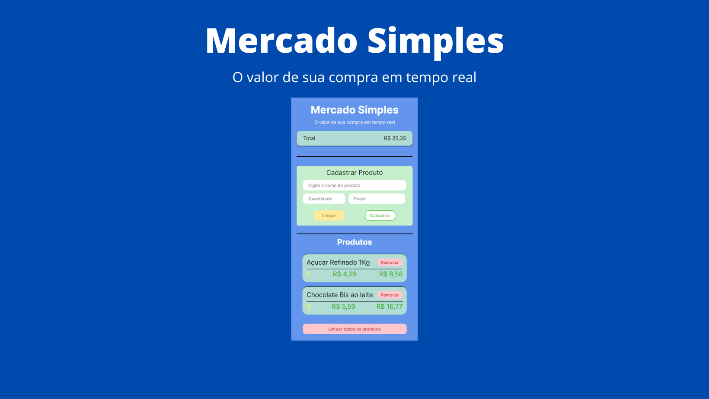

<h1 align="center">
  
Mercado Simples

  
</h1>

  
  
  
  
  
  
  

# Introdução

Mercado simples é uma aplicação para te auxiliar na hora de fazer as compas, cadastre os produtos adicionados ao carrinho
e acompanhe em tempo real o valor total de sua compra.

# 🔨 Funcionamento

- Cadastre os produtos adicionados ao carrinho;

- Veja a lista com todos os produtos adicionados até o momento;

- Remova um produto da lista(ao remover do carrinho);

- Remova todos os produtos de uma só vez;

https://user-images.githubusercontent.com/58310961/191799241-757ab9d5-e996-4591-b105-1f562bf12f71.mp4

# Instalação

Após baixar o projeto, utilize o comando:

<code>
  npm install
</code>

para instalar as dependencias necessárias e depois,
para rodar em modo desenvolvimento, utilize:

<code>
  npm run dev
</code>

# ✔️ Tecnologias utilizada
- ``Vite``
- ``ReactJS``
- ``Typescript``

# 📄 Licença

Esse projeto está sob a licença MIT. Veja o arquivo [LICENSE](./license) para mais detalhes.
